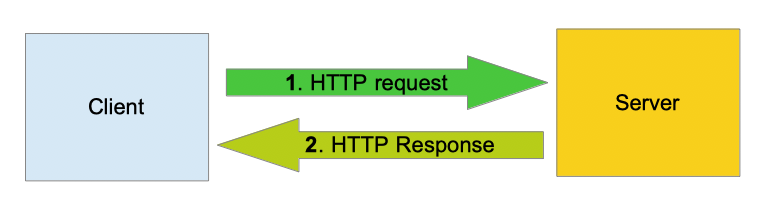

# Client

The **client** is the party that will send the request to the **server**.

<figure><figcaption></figcaption></figure>

When you create an HTTP client, you can specify the following options : `Transport` (type : `http.RoundTripper`): You can custom the way your HTTP requests will be executed by setting this field to a type that implements the type interface `http.RoundTripper`.


```go
// NewClient Takes in the optional arguments: proxy, servername
func NewClient(parameters ...string) (*Client, error) {
	if len(parameters) > 0 && len(parameters[0]) > 0 {
		proxy = parameters[0]
	}

	newClient, err := createClient(proxy)
	if err != nil {
		createCResponse(&Response{
			status:     "error",
			statusCode: 500,
			body:       []byte(err.Error()),
		})

		return nil, err

	}

	return &Client{
		client:         newClient,
		LatestResponse: &Response{},
	}, nil
}
```
